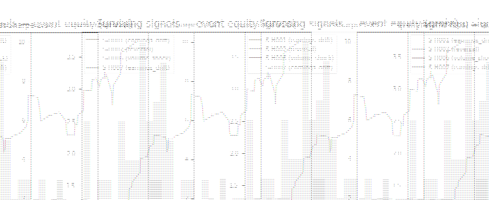

# AlphaForge — Autonomous Anomaly Discovery & Validation Agent

**A multi-agent research system that generates hypotheses, fetches market data,
statistically tests every idea with multiple-testing correction, backtests
survivors out-of-sample, and writes an honest report — including honest null
results.**

## Demo



*Animation of a real run (`python scripts/make_demo_gif.py`): the surviving
signals' event-equity curves and return histograms build up over the test
period, with the out-of-sample test Sharpe in the panel title. For a terminal
walkthrough, `demo.tape` renders via [vhs](https://github.com/charmbracelets/vhs).*

```
seed query ──▶ hypothesis ──▶ data ──▶ validation ──▶ [HITL checkpoint] ──▶ backtest ──▶ report
              agent          agent     agent                                  agent       agent
              (templates/    (4 MCP   (Bonferroni + BH-FDR                    (event      (markdown +
               LLM refine)    servers)  + sign gate)                           backtest)    plots)
                                      │
                                      └─ 0 survivors ─────────────▶ null-result report (feature, not failure)
```

## Why this is different from every other agent demo

**Statistical rigor lives inside the agent loop.** A system that "discovers"
10/10 winning signals is p-hacking itself. AlphaForge is built to *kill bad
ideas*:

- Every hypothesis is corrected with **Bonferroni (α=0.05) AND Benjamini-Hochberg FDR (q=0.10)**
- Significance alone is not enough — the **effect sign must match the hypothesis's
  prediction**, or the idea is rejected
- Survivors are backtested **out-of-sample** (train ≤ 2022 / test ≥ 2023) with
  **10 bps round-trip transaction costs**
- **Null results are first-class**: when nothing survives, the report explains
  exactly why each hypothesis failed
- Every failure path is explicit: retries (3×, exponential backoff) → fallback →
  `UNTESTABLE` marking. Nothing is silently dropped.

## Architecture

Built on **LangGraph** (StateGraph, shared Pydantic `ResearchState`, conditional
edges, HITL interrupt) with tool-calling over **4 custom MCP servers** (official
`mcp` SDK / FastMCP — connectable from Claude Desktop or Claude Code):

| MCP server | Tools | Implementation |
|---|---|---|
| `mcp-market-data` | `get_ohlcv`, `get_earnings_calendar`, `list_universe`, `get_index_constituents` | yfinance wrapper + SHA-256-verified parquet cache, rate-limited; deterministic synthetic mode |
| `mcp-statistics` | `run_ttest`, `run_ttest_1samp`, `run_mannwhitney`, `bootstrap_ci`, `apply_bonferroni`, `apply_bh_fdr` | scipy + numpy only; unit-tested against scipy and statsmodels references |
| `mcp-backtest` | `run_event_backtest` | vectorized event study; strict train/test split; cost model |
| `mcp-retrieval` | `semantic_search` | TF-IDF by default; **dense backend** (BGE-style encoder + cosine/FAISS) selected via `ALPHAFORGE_RETRIEVER=dense` — the drop-in slot for the BLaIR fine-tuned retriever |

### The LLM-optional design

The hypothesis agent has two interchangeable backends:

- **`template` (default)** — deterministic seeded instantiation from
  `hypothesis_templates.yaml` (6 families × parameter grids). Zero API cost,
  fully reproducible, runs offline. This is what CI and the eval harness use.
- **`claude`** — the LLM refines/rewords template hypotheses via structured
  (Pydantic-validated) output. Requires `ANTHROPIC_API_KEY`.

Both produce identical downstream behavior: everything is schema-validated, so
a malformed LLM output can never enter the research loop.

### Synthetic mode (and why it exists)

`mode: synthetic` generates a deterministic seeded market with **documented,
planted effects** (post-earnings drift +60bps/day, reversal bounce +40bps/day,
volume-shock drift −30bps/day, Monday −5bps). This makes the entire system
verifiable end-to-end with no network, no keys, no flakiness:

- statistics tests assert exact scipy parity
- backtest tests assert **sign recovery** of the planted effects
- the eval harness runs 20 tasks deterministically in CI
- the null-result path is exercised with impossible gates

`mode: live` switches to real yfinance data through the same cache/schema layer.
Everything downstream is mode-agnostic.

## Quick start

```bash
pip install -e ".[dev]"
pytest -q                                   # 50+ tests, offline
alphaforge "post-earnings drift in megacap tech"   # full pipeline run (synthetic)
python evals/harness.py                     # 20-task eval suite -> evals/results.md
```

Live data + Claude-refined hypotheses (real API calls with token-level cost
accounting; fails loudly if the key is missing — never silently pretends):

```bash
pip install -e ".[live,llm]"
export ANTHROPIC_API_KEY=sk-...
alphaforge "sector rotation momentum" --mode live --llm claude
```

Prompts are versioned in `src/alphaforge/prompts/` (git history = audit
trail). LLM output never enters the loop unvalidated: refined hypotheses must
pass the same Pydantic schema, and invalid rewordings fall back to the
deterministic template statement (tracked in `rejected_outputs`).

Interactive human-in-the-loop checkpoint — genuinely pauses the graph
(checkpointer-backed interrupt/resume) and waits for approve/reject:

```bash
alphaforge "volume shocks" --interactive
```

### Connect the MCP servers to Claude Desktop / Claude Code

```json
{
  "mcpServers": {
    "mcp-statistics": {
      "command": "python",
      "args": ["-m", "alphaforge.mcp_servers.statistics.server"]
    },
    "mcp-market-data": {
      "command": "python",
      "args": ["-m", "alphaforge.mcp_servers.market_data.server"]
    },
    "mcp-backtest": {
      "command": "python",
      "args": ["-m", "alphaforge.mcp_servers.backtest.server"]
    },
    "mcp-retrieval": {
      "command": "python",
      "args": ["-m", "alphaforge.mcp_servers.retrieval.server"]
    }
  }
}
```

The MCP servers are tested over the real wire protocol (official stdio
client → JSON-RPC → all 4 servers), not just in-process — see
`tests/test_mcp_protocol.py`.

## Eval results

See **[evals/results.md](evals/results.md)** — produced by a real run of
`python evals/harness.py` on this checkout (synthetic mode, template backend,
seed 42). Re-run the harness to reproduce every number.

## Repo layout

```
src/alphaforge/
├── orchestrator/graph.py        # LangGraph StateGraph, routing, HITL, retries
├── state/schema.py              # Pydantic ResearchState + all tool I/O schemas
├── agents/                      # hypothesis, data, validation, backtest, report
│   └── hypothesis_templates.yaml
├── mcp_servers/                 # 4 FastMCP servers (statistics is the rigor engine)
├── events/builders.py           # family event builders (validation ≡ backtest)
├── utils/                       # cache, config, JSON logging
└── cli.py                       # alphaforge CLI
evals/                           # 20-task suite + harness + real results
tests/                           # 50+ unit/integration tests (offline)
```

## Development

This repo was built AI-assisted (Claude Code as the coding agent, human-reviewed
every diff), with `CLAUDE.md` and `.claude/skills/` encoding the review
checklists (hypothesis review, stats-gate check, backtest review). Commit
history reflects the incremental build.

## Limitations

- Synthetic-mode results validate the pipeline, not real alpha. Run `--mode live`.
- Event-study Sharpe annualizes by events-per-year over the **evaluation window**
  and reports `n_independent` (non-overlapping event windows) alongside raw
  counts — overlapping events still share return windows, so raw-count Sharpe
  overstates effective sample size. No overlapping-position capital model.
- Flat cost model (bps round-trip); no market impact or slippage curve.
- Live earnings data (yfinance) reaches back only ~4 years, so earnings-driven
  hypotheses have thin train-split samples in live mode; results reflect the
  real, thinner sample rather than hiding it.
- BH/Bonferroni protect within a run; cross-run specification search still
  inflates discovery risk — the OOS split is the primary defense.

## License

MIT
