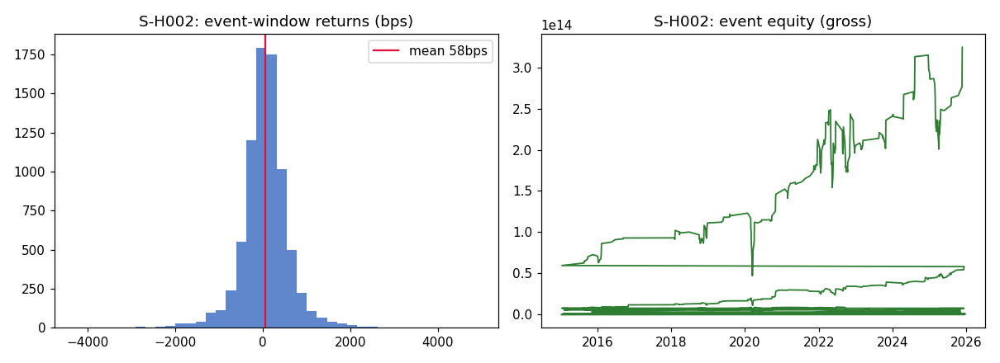
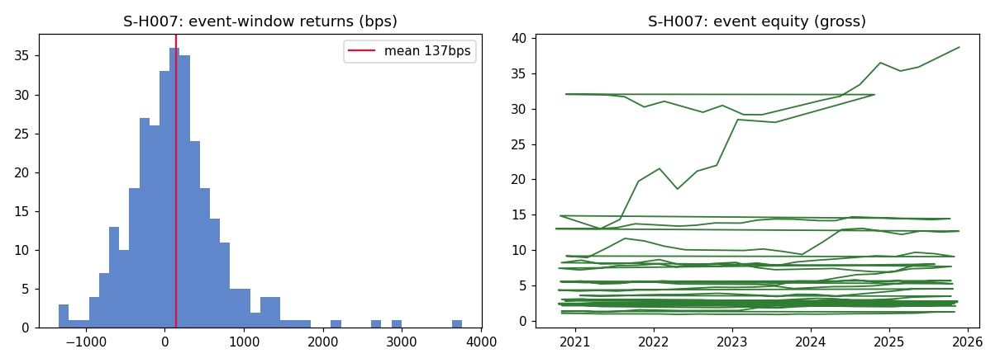
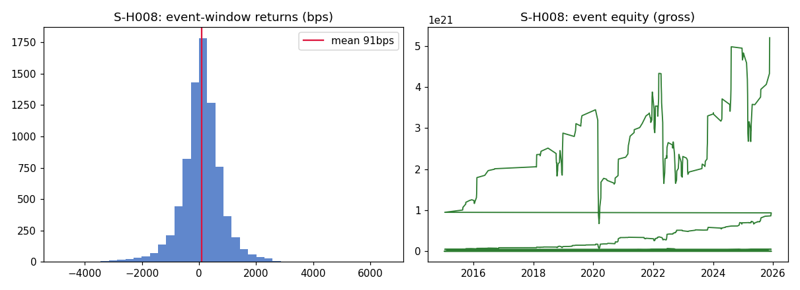

# AlphaForge Research Report

- **Seed query**: earnings drift in megacap tech
- **Generated**: 2026-09-14T19:07:03
- **Config**: seed=42, data_mode=live, llm_backend=template
- **Multiple-testing gates**: Bonferroni α=0.05, BH-FDR q=0.1
- **Backtest**: train ≤ 2022-12-31, test ≥ 2023-01-01, cost 10.0bps round-trip

## Surviving signals

4 of 8 tested hypotheses survived Bonferroni/BH-FDR correction AND the expected-sign check.

| Signal | Hypothesis | Family | Test Sharpe | Test mean (bps) | Max DD | Win rate | n (train/test) |
|---|---|---|---|---|---|---|---|
| S-H001 | H001 | earnings_drift | 0.597 | 66.33 | -28.1% | 60.0% | 31/40 |
| S-H002 | H002 | reversal | 2.016 | 101.82 | -64.9% | 60.2% | 883/221 |
| S-H007 | H007 | earnings_drift | 1.682 | 273.87 | -18.3% | 59.4% | 54/64 |
| S-H008 | H008 | reversal | 3.829 | 232.14 | -98.0% | 62.6% | 1831/644 |

## Statistical validation (all tested hypotheses)

| ID | Family | Test | Stat | p | Effect (bps) | 95% CI (bps) | n | Bonf. | BH-FDR | Verdict |
|---|---|---|---|---|---|---|---|---|---|---|
| H001 | earnings_drift | one_sample_ttest | 3.94 | 0.0001 | +136.8 | [+69.4, +205.2] | 308 | ✔ | ✔ | backtested |
| H002 | reversal | two_sample_ttest | 4.66 | 0.0000 | +23.0 | [+10.6, +35.6] | 7888 | ✔ | ✔ | backtested |
| H003 | vol_regime | two_sample_ttest | 10.68 | 0.0000 | +52.6 | [+39.5, +66.2] | 7863 | ✔ | ✔ | rejected |
| H004 | sector_momentum | two_sample_ttest | -9.44 | 0.0000 | -59.8 | [-72.3, -47.0] | 49014 | ✔ | ✔ | rejected |
| H005 | day_of_week | two_sample_ttest | 1.64 | 0.1004 | +2.9 | [-0.5, +6.3] | 14767 | ✘ | ✘ | rejected |
| H006 | volume_shock | two_sample_ttest | 2.08 | 0.0378 | +17.3 | [-6.8, +41.7] | 2553 | ✘ | ✔ | rejected |
| H007 | earnings_drift | one_sample_ttest | 3.94 | 0.0001 | +136.8 | [+69.4, +205.2] | 308 | ✔ | ✔ | backtested |
| H008 | reversal | two_sample_ttest | 2.77 | 0.0056 | +19.2 | [+2.1, +35.6] | 7874 | ✔ | ✔ | backtested |

## Literature grounding (mcp-retrieval)

> Post-earnings announcement drift (PEAD) is the empirical observation that stock
prices continue to move in the direction of an earnings surprise for several
weeks after the announcement. Ball and Brown (1968) first documented the effect.
Explanations include underreaction to new information and limited investor
attention. The drift is strongest for high-surprise stocks and weakens after
public disclosure of the anomaly.
> — *corpus:Post-earnings announcement drift (PEAD) is the empirical obs*

> # AlphaForge grounding corpus — small curated snippets used by mcp-retrieval
# to ground the discussion section of research reports. Replace/extend with
# EDGAR filings text or earnings-call transcripts for live use.
> — *corpus:# AlphaForge grounding corpus — small curated snippets used *

> Human-in-the-loop review in agentic research systems: automated pipelines can
propose and test hypotheses at scale, but checkpoint reviews before capital
allocation are critical. A checkpoint after statistical validation and before
backtesting lets a researcher reject technically significant but
economically implausible signals.
> — *corpus:Human-in-the-loop review in agentic research systems: automa*

## Limitations & false-discovery discussion

- Synthetic-mode results validate the *pipeline*, not real market alpha. Planted effects are recoverable by construction; run `--mode live` for real data.
- 8 hypotheses were tested this run; even with Bonferroni/BH-FDR gates, in-sample specification search across template parameters inflates discovery risk. The out-of-sample split is the primary defense.
- Event-study Sharpe is annualized by events-per-year scaling and does not model overlapping-position capital constraints or execution slippage beyond the flat 10.0bps round-trip cost.
- Earnings dates and surprise values in live mode depend on vendor data quality; the synthetic mode uses deterministic planted surprises.
